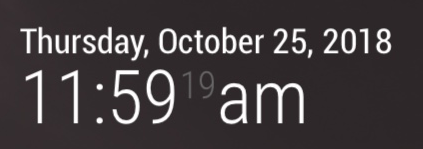
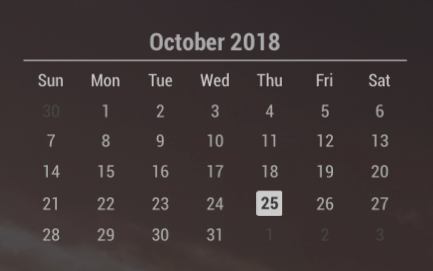
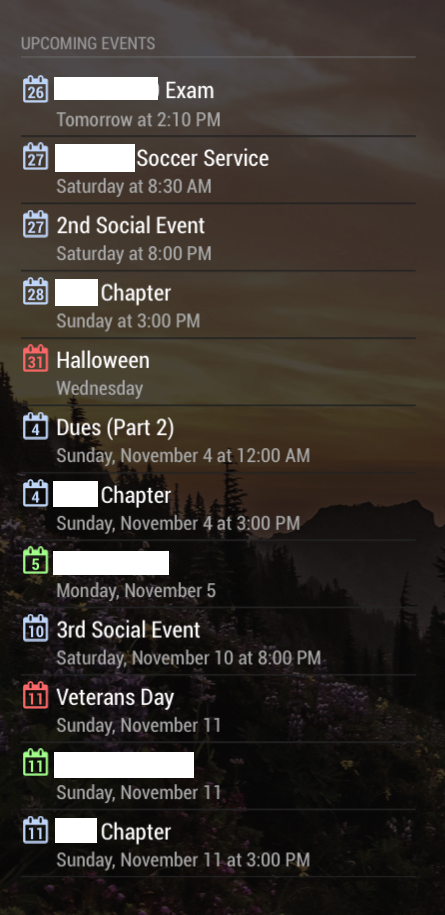
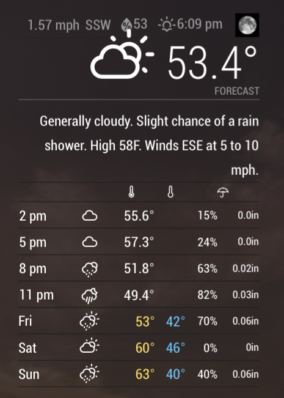
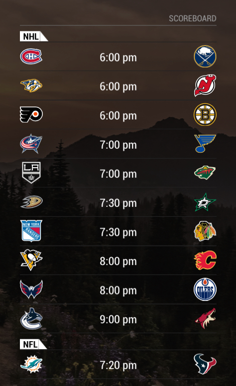
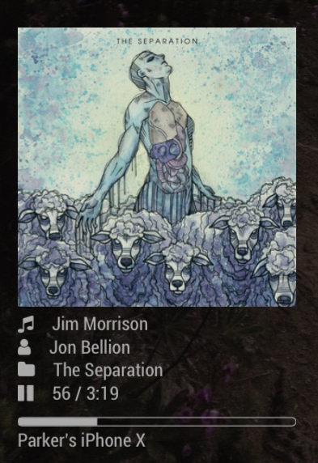
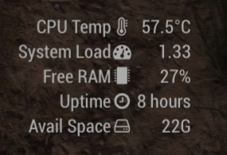
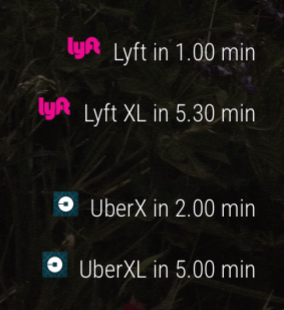

# StatusBoard

<p align="center"></p>

Howdy everyone,

Firstly, let me apologize for how long this took me to finally write, I’ve been busy with a job, classes, and personal (planned, nothing bad) stuff requiring most of my attention. Regardless, I wanted to get this written and out to y’all earlier, but now is better than never so here we go!

How I’m going to do this is my best attempt at a step-by-step repeat of what I did. I will note, in terms of actually getting the MagicMirror<sup>2</sup> framework running, I will simply refer to the guides that I used myself.

After that I will provide my config.js file, and go through each part, explaining what I changed to get all of the modules installed and running properly. While explaining each module, I will share any .css or .js changes I made. Let’s get started!

[Here is what the current setup is looking like](img/MagicMirror.JPG) in person because I've made a bunch of small adjustments since the first time that I posted about this. These changes are appearance-, functionality-, and/or efficiency-related so some may not be noticable or particularly useful to you.

**Step 1: Installing MagicMirror<sup>2</sup>**

Here are the multiple sites I used to set up my Pi for MagicMirror

https://howchoo.com/g/ntcymzbimjv/how-to-install-magic-mirror-on-your-raspberry-pi

https://forum.magicmirror.builders/topic/236/complete-setup-tutorial

https://github.com/MichMich/MagicMirror#installation

https://github.com/MichMich/MagicMirror/wiki/jessie-lite-installation-guide
________________

**Step 2: Installing and Modifying Modules**

It would probably be in your best interest to take a look at [the entire config.js file](config/config.js) before you get started, to at least have a brief understanding of what's going on as a whole.

Now, going through that, there’s a lot of info and if you don’t know what you’re doing it might not make a bunch of sense. So, let’s go through each part and see what I’ve got. I should note that I will not be covering how to install the modules that require API keys/tokens as the creators of each has provided explanations and instructions themselves.

The installation for most of these modules is pretty darn easy, and all of them include more in-depth information on how to install if you run into any trouble here. (If you do know what you’re doing, it is possible to simply install all of the modules first and then implement/modify from there. However, I would *strongly* recommend going one-by-one so that in the case that something does break, you can quickly identify the issue.)

First things first, to do anything you're going to need to SSH into the Pi or have a keyboard and mouse connected in order to install everything. Each module installation here assumes you are starting in the `/home/pi/` directory for simplicity's sake.

For help positioning your modules, [this is a handy guide explaining the different regions/positions.](https://forum.magicmirror.builders/topic/286/regions)

The following information can be ignored and should not be changed unless you know what you are doing. This did not need to be modified for me. [Here is a link to the official documentation regarding this section.](https://github.com/MichMich/MagicMirror#configuration)
________

**Step 2.1**

```js
/* Magic Mirror Config Sample
 *
 * By Michael Teeuw http://michaelteeuw.nl
 * MIT Licensed.
 *
 * For more information how you can configurate this file
 * See https://github.com/MichMich/MagicMirror#configuration
 *
 */

var config = {
	address: "localhost", // Address to listen on, can be:
	                      // - "localhost", "127.0.0.1", "::1" to listen on loopback interface
	                      // - another specific IPv4/6 to listen on a specific interface
	                      // - "", "0.0.0.0", "::" to listen on any interface
	                      // Default, when address config is left out, is "localhost"
	port: 8080,
	ipWhitelist: ["127.0.0.1", "::ffff:127.0.0.1", "::1"], // Set [] to allow all IP addresses
	                                                       // or add a specific IPv4 of 192.168.1.5 :
	                                                       // ["127.0.0.1", "::ffff:127.0.0.1", "::1", "::ffff:192.168.1.5"],
	                                                       // or IPv4 range of 192.168.3.0 --> 192.168.3.15 use CIDR format :
	                                                       // ["127.0.0.1", "::ffff:127.0.0.1", "::1", "::ffff:192.168.3.0/28"],
```

The next bit is dependent on your region and should be adjusted accordingly. For me, that meant changing the time format from 24-hour to 12-hour, and changing from metric to imperial units.

```js
	language: "en",
	timeFormat: 12,
	units: "imperial",
	modules: [
```
________

**Step 2.2**

Now we get to the fun part, the modules. First up are some of the default modules. These were the **alert**, **updatenotification**, and **clock** modules in my case. For all of them I happened to leave the individual configurations alone. If you would like to modify them, [here is the documentation for the default modules.](https://github.com/MichMich/MagicMirror#modules)

<p align="center"></p>

```js
{
	module: "alert",
},
{
	module: "updatenotification",
	position: "top_bar"
},
{
	module: "clock",
	position: "top_left"
},
```
________

**Step 2.3**

The first 3rd party module that I used is [**calendar_monthly**](https://github.com/KirAsh4/calendar_monthly)

A simple module used to show a monthly view of the current month, with the current day highlighted. The only setting here that I set is the position which I set to “top_left”. Declaring it after the default clock module means that the calendar will appear underneath the clock, my personal preference.

<p align="center"></p>

1.) Navigate to the `modules` directory

	cd MagicMirror/modules

2.) Clone from GitHub

	git clone https://github.com/KirAsh4/calendar_monthly

3.) Add the configuration to config.js

```js
{
	module: "calendar_monthly",
	position: "top_left"
},
```
________

**Step 2.4**

The next module is [**MMM-MyCalendar**](https://github.com/jclarke0000/MMM-MyCalendar)

MMM-MyCalendar is the first module I am using from suite of modules produced by Jeff Clarke, details of which [can be found on his site](http://jeffsnerdyprojects.blogspot.com/2017/07/my-custom-modules-for-my-smart-mirror.html). This is placed in the top_left as well, underneath the monthly calendar. I am using the Holiday calendar that is included with the default calendar module, as well as two calendars that keep track of different groups’ birthdays. You can add and remove calendars as you see fit, though the URL for your specific calendar will depend on the program you are using to maintain it.

<p align="center"></p>

1.) Navigate to the `modules` directory

	cd MagicMirror/modules

2.) Clone from GitHub

	git clone https://github.com/jclarke0000/MMM-MyCalendar.git

3.) Add the configuration to config.js

```js
{
	module: "MMM-MyCalendar",
	header: "Upcoming Events",
	position: "top_left",
	config: {
		colored: true,
		hideOngoing: false,
		showLocation: false,
		useRelativeDates: true,
		calendars: [
			{
				symbol: "calendar",
				url: "webcal://www.calendarlabs.com/templates/ical/US-Holidays.ics",
				color: "#009900"
			},
			{
				symbol: "birthday-cake",
				url: "CALENDAR_2_URL",
				color: "#105bfb"
			},
			{
				symbol: "birthday-cake",
				url: "CALENDAR_3_URL",
				color: "#fbcd10"
			}
		]
	}
},
```
________

**Step 2.5**

Another module from Jeff Clarke, [**MyWeather**](https://github.com/jclarke0000/MMM-MyWeather), is next up

MMM-MyWeather provides in-depth weather details provided through the Weather Underground API, and is built upon the MMM-WunderGround module from RedNax67. Some may notice that this uses Weather Underground and that they no longer provide API keys to new members and will be shutting down their API at the end of the year. I have not gotten around to finding a long-term solution to this, so I apologize as I do not have an alternative I can recommend right now.

<p align="center"></p>

1.) Navigate to the `modules` directory

	cd MagicMirror/modules

2.) Clone from GitHub

	git clone https://github.com/jclarke0000/MMM-MyWeather.git

3.) Add the configuration to config.js

```js
{
	module: 'MMM-MyWeather',
	position: 'top_right',
	config: {
		apikey: "WUNDERGROUND API KEY", // private; don't share!
		pws: "pws:XXXXXXXNN",
		colorIcon: true,
		fadePoint: ".75",
		fcdaycount: "2",
		fcdaystart: "0",
		hourly: "1",
		hourlyinterval: 1,
		hourlycount: 3,
		alerttime: 10000,
		alerttruncatestring: "english:",
		roundTmpDecs: 1,
		windunits: "mph",
		UseCardinals: 1,
		layout: "vertical",
		iconset: "flat_colourful",
		sysstat: 0
	}
},
```

One thing that has been bothering me slightly that was also pointed out when I first posted about this was that the Current Weather icon overlaps with the bar above if the icon has any sun rays as the image is a bit taller. Modifying the CSS here didn't have any effect unfortunately. Another issue is that I am not able to change the iconset at all. This one has really stumped me but I'm working on finding a fix still.
________

**Step 2.6**

[**MMM-MyScoreboard**](https://github.com/jclarke0000/MMM-MyScoreboard) is the third of Jeff’s modules I am using

This is a rather straightforward module which just shows scores for various games across various leagues. You can specify a single team, multiple specific teams, a division/conference/etc., an entire league, and more, of which you can follow and display the scores. In my case, I am showing all scores across NHL, MLB, NFL, and March Madness (when that finally comes around!) There are several other sports included in this module for those that are interested, and I know that there are other modules that display information for sports not included in this module.

<p align="center"></p>

1.) Navigate to the `modules` directory

	cd MagicMirror/modules

2.) Clone from GitHub

	git clone https://github.com/jclarke0000/MMM-MyScoreboard.git

3.) Add the configuration to config.js

```js
{
	module: "MMM-MyScoreboard",
	position: "top_right",
	classes: "default everyone",
	header: "Scoreboard",
	config: {
	 	showLeagueSeparators: true,
	 	colored: true,
		rolloverHours: 5,
	 	viewStyle: "mediumLogos",
	 	sports: [
	 	{
	 		league: "NHL"
	 	},
	 	{
	 		league: "MLB"
	 	},
	 	{
	 		league: "NFL"
	 	},
	 	{
	 		league: "NCAAM_MM",
	 		label: "March Madness"
	 	}
	 	]
	 }
},
```
________

**Step 2.7**

Next is [**MMM-NowPlayingOnSpotify**](https://github.com/raywo/MMM-NowPlayingOnSpotify)

This is a small but useful module that does exactly what the name suggests; shows you what is playing on Spotify!

<p align="center"></p>

In order to get the information necessary to get this working, I would ***highly*** recommend looking at the official documentation linked above as it includes the steps I followed to get it working.

```js
{
	module: "MMM-NowPlayingOnSpotify",
	position: "bottom_left",
	config: {
		clientID: "CLIENTID",
		clientSecret: "CLIENTSECRET",
		accessToken: "ACCESSTOKEN",
		refreshToken: "REFRESHTOKEN",
		updatesEvery: 15
	}
},
```
________

**Step 2.8**

Another simple and straightforward module, [**MMM-SystemStats**](https://github.com/BenRoe/MMM-SystemStats)

<p align="center"></p>

1.) Navigate to the `modules` directory

	cd MagicMirror/modules

2.) Clone from GitHub

	git clone https://github.com/BenRoe/MMM-SystemStats

3.) Navigate to `MMM-SystemStats` directory

	cd MMM-SystemStats

4.) Run installation

	npm install

5.) Add the configuration to config.js

```js
{
	module: "MMM-SystemStats",
	position: "bottom_center", // This can be any of the regions.
	classes: "small", // Add your own styling. Optional.
	config: {
		updateInterval: 10*1000, // every 10 seconds
		animationSpeed: 0,
		align: "right", // align labels
		//header: 'System Stats', // This is optional
	},
},
```
________

**Step 2.9**

I am going to group these next two together, [**MMM-lyft**](https://github.com/kyle-kelly/MMM-lyft) and its companion [**MMM-uber**](https://github.com/kyle-kelly/MMM-uber)

<p align="center"></p>

Like Spotify, both Uber and Lyft have explanations within their documentation detailing how to acquire the proper keys. Again, I ***highly*** recommend taking a look at the links above to find those instructions.

```js
{
	module: "MMM-lyft",
	position: "bottom_right",
	config: {
		ride_types: ["Lyft","Lyft XL"],
		lat: XX.XXXXX,  // use your exact pickup location
		lng: YY.YYYYY, // use your exact pickup location
		clientId: "CLIENTID",
		clientSecret: "CLIENTSECRET"
	}
},
{
	module: "MMM-uber",
	position: "bottom_right",
	config: {
		ride_types: ["UberX","UberXL"],
		lat: XX.XXXXX,  // use your exact pickup location
		lng: YY.YYYYY, // use your exact pickup location
		uberServerToken: "TOKEN",
	}
},
```

I had to make a minor modification to the MMM-lyft.js and MMM-uber.js files due to an annoying bug that caused there to be repeating decimals on the screen, taking away from the clean look I was going for. For MMM-lyft, that is changing line 137:

`var myText = this.config.ride_types[element_idx] + " in "+ this.lyftTimes[element_idx] +" min ";`

by adding a requirement to round to 2 decimals points using `.toFixed(2)` shown below.

`var myText = this.config.ride_types[element_idx] + " in "+ (this.lyftTimes[element_idx]).toFixed(2) +" min ";`

Adding the same function `.toFixed(2)` to the same variable for MMM-uber takes place on line 128 rather than 137.
________

**Step 2.10**

Onto the last default module that I used and one of the most popular, the **newsfeed** module. Again, [here is the documentation for the default modules.](https://github.com/MichMich/MagicMirror#modules)

<p align="center"></p>

This is a pretty straightforward module which simply displays news stories from specified RSS feeds. The default one included in the module is the New York Times but I have adjusted them to show the following. (Note: reddit allows you to view posts in an RSS format by adding “/.rss” to the end of a valid reddit URL.)

```js
{
	module: "newsfeed",
	position: "bottom_bar",
	config: {
		updateInterval: 45*1000, // 45 seconds
		ignoreOldItems: true,
		wrapTitle: false,
		feeds: [
			{
				title: "CNN",
				url: "http://rss.cnn.com/rss/cnn_topstories.rss"
			},
			{
				title: "/r/Science",
				url: "https://www.reddit.com/r/science/.rss"
			},
			{
				title: "r/Technology",
				url:"https://www.reddit.com/r/technology/.rss"
			},
			{
				title: "r/News",
				url: "https://www.reddit.com/r/news/.rss"
			},
			{
				title: "WIRED Science",
				url: "https://www.wired.com/feed/category/science/latest/rss"
			}
		],
		showSourceTitle: true,
		showPublishDate: true
	}
},
```
________

**Step 2.11**

Last but certainly not least, is [**MMM-Wallpaper**](https://github.com/kolbyjack/MMM-Wallpaper)

This module is vital in turning my MagicMirror into the StatusBoard I know and use today. It allows you to pull from one of several different sources for images, and I used /r/EarthPorn because I love having some nice natural backgrounds whenever possible. Other sources are addressed in the official documentation but subreddits can simply be called by using “/r/SUBREDDIT_NAME”

1.) Navigate to the `modules` directory

	cd MagicMirror/modules

2.) Clone from GitHub

	git clone https://github.com/kolbyjack/MMM-Wallpaper.git

3.) Add the configuration to config.js

```js
		{
		  module: "MMM-Wallpaper",
		  position: "fullscreen_below",
		  config: { // See "Configuration options" for more information.
		  	source: "/r/EarthPorn",
		  	slideInterval: 10*60*1000, // Change slides every 10 minutes
		  	orientation: "vertical"
		  }
		},
	]
};

/*************** DO NOT EDIT THE LINE BELOW ***************/
if (typeof module !== "undefined") {module.exports = config;}
```

And that’s the whole config.js!!
________________

**Step 3: Setting Up Custom CSS**

MagicMirror<sup>2</sup> offers a super easy, super convenient way to add your own CSS options to any of the modules installed, as well as any particular aspect you choose.

I have [uploaded my custom CSS here.](css/custom.css) Please feel free to check it out.
________________

**Step 4: CRON Jobs**

For those of you who know what CRON is, you likely know just how powerful it can be. For those of you that don't, CRON is an unbelievably useful utility that allows you to run commands or scripts on a schedule all the way down to every minute. You can adjust it by minutes, hours, days of the month, month, and days of the week.

I currently have 2 CRON jobs running to help make my setup a little better in my opinion.

The first is a simple restart at 4am every morning

`0 4 * * * sudo reboot`

The second is a bit more involved. It checks every minute to see if my iPhone's Bluetooth is within range. If my phone is within range of the Pi, the display turns on. Likewise, if my phone does not have Bluetooth enabled or it is not within range, the display turns off.

`* * * * * bash BT-AutoDisplay2.sh`

This is done using a bash script I wrote called [BT-AutoDisplay](https://github.com/drippyer/BT-AutoDisplay). In order to get BT-AutoDisplay to work, I installed [bluetooth-proximity](https://github.com/ewenchou/bluetooth-proximity), a python script for the actual proximity part (y'know, the hard stuff). I do this as a way to try to extend the life of my monitor automatically without purchasing any additional hardware, like a PIR sensor (although I am considering getting one and using both in conjunction). 
________________

That's everything!!

Hope you found this useful and informative! Let me know if you have any questions by opening an issue here, replying to the reddit thread this is posted from, or [PM'ing me on reddit](https://www.reddit.com/message/compose/?to=drippyer&subject=[StatusBoard]:)

Enjoy and have a great day!